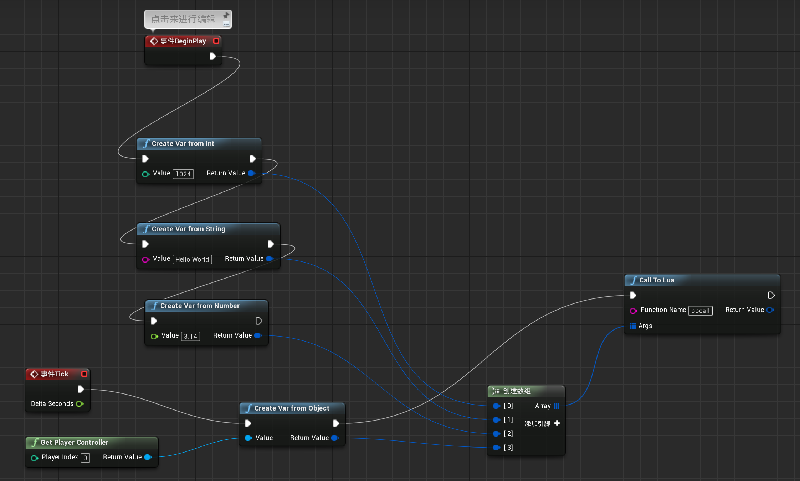

# slua-unreal 是什么 

slua-unreal作为unreal引擎的插件，通过unreal自带蓝图接口的反射能力，结合libclang静态c++代码分析，自动化导出蓝图接口和静态c++接口，提供给lua语言，使得可以通过lua语言开发unreal游戏业务逻辑，方便游戏高效迭代开发，上线热更新，同时支持lua到c++双向，lua到蓝图双向调用，使用lua语言完美替代unreal的c++开发方式，修改业务逻辑不需要等待c++编译，大大提升开发速度。

目前该项目作为潘多拉系统的一部分，用于部分腾讯游戏业务，构建这些业务的周边系统、运营系统，上线质量稳定。

欢迎issue，pr，star，fork。

## What's slua-unreal?

slua-unreal is unreal4 plugin, you can use lua language to develop game login and hot fix your lua code via this plugin, slua-unreal give you 3 way to wrap your c++ interface fro lua, including reflection(by blueprint), c++ template and static code generation by a tool, meanwhile you can communicate with blueprint, call lua from blueprint, vice versa.

# slua-unreal 有什么功能

* 通过蓝图反射机制，自动导出unreal 4的蓝图api到lua接口
* 支持以lua function作为蓝图事件的回调函数
* 支持普通c++函数和类 通过静态代码生成或者泛型代码展开导出到lua接口，同时支持与蓝图接口交互
* 完整支持了unreal4的枚举，并导出了全部枚举值到lua
* 支持FVector等非蓝图类，同时支持操作符重载
* 支持扩展方法，将某些未标记为蓝图方法的函数，手动添加到蓝图类中，例如UUserWidget的GetWidgetFromName方法。
* 支持从蓝图中调入lua，并接收lua返回值，支持任意参数类型和任意参数个数。
* 支持蓝图out标记参数，支持c++非const引用作为out类型参数返回。

## Feature

* call reflection method exported by blueprint
* add event listener for blueprint event as lua function
* normal c++ function and class exported by c++ template 
* auto code generation to wrap your normal c++ fucntion to lua
* support enum, FVector etc
* support operator overload in FVector or other struct class
* support extension method to add a non-blueprint function to uobject for lua use(extent bluepirnt function)
* call lua function from blueprint, vise versa

# 使用方法简单范例

## Usage at glance

```lua
-- import blueprint class to use
local Button = import('Button');
local ButtonStyle = import('ButtonStyle');
local TextBlock = import('TextBlock');
local SluaTestCase=import('SluaTestCase');
-- call static function of uclass
SluaTestCase.StaticFunc()
-- create Button
local btn=Button();
local txt=TextBlock();
-- load panel of blueprint
local ui=slua.loadUI('/Game/Panel.Panel');
-- add to show
ui:AddToViewport(0);
-- find sub widget from the panel
local btn2=ui:FindWidget('Button1');
local index = 1
-- handle click event
btn2.OnClicked:Add(function() 
    index=index+1
    print('say helloworld',index) 
end);
-- handle text changed event
local edit=ui:FindWidget('TextBox_0');
local evt=edit.OnTextChanged:Add(function(txt) print('text changed',txt) end);

-- use FVector
local p = actor:K2_GetActorLocation()
local h = HitResult()
local v = FVector(math.sin(tt)*100,2,3)
local offset = FVector(0,math.cos(tt)*50,0)
-- support Operator
local ok,h=actor:K2_SetActorLocation(v+offset,true,h,true)
-- get referenced value
print("hit info",h)
```

## 在蓝图中调用lua

## Blueprint call lua



```
-- this function called by blueprint
function bpcall(a,b,c,d)
    print("call from bp",a,b,c,d)
end
```

Output is:

Slua:     call from bp    1024    Hello World 3.1400001049042 UObject: 0x136486168

## 性能

slua-unreal提供3中技术绑定lua接口，包括：

1）蓝图反射方法

2）静态代码生成

3）CppBinding（模板展开）

其中方法2和3运行原理上没差别，只是方法2是基于libclang自动化生成代码，方法3是手写代码，所以下面的统计上仅针对1和3来对比，可以认为2和3的性能是等价的。

100万次函数调用时间统计（秒），测试用例可以参考附带的TestPerf.lua文件。

测试机器 MacOSX，Unreal 4.18 dev版（非release，release应该会稍微快一点），CPU i7 4GHz。

### Performance

unit in second, 1,00,000 call to c++ interface from lua, compared reflection and cppbinding, (both reflection and cppbinding support by slua-unreal).

Test machine, MacOSX, Unreal 4.18 develop building, CPU i7 4GHz, test case can find in TestPerf.lua

|                                                              | 蓝图反射方法(Reflection) | CppBinding方法(CppBinding) |
| ------------------------------------------------------------ | ------------------------ | -------------------------- |
| 空函数调用(empty function call)                              | 0.541507                 | 0.090571                   |
| 函数返回int(function return int)                             | 0.560052                 | 0.090419                   |
| 传入int函数返回int(function return int and pass int)         | 0.587115                 | 0.097639                   |
| 传入Fstring函数返回int(function return FString and pass int) | 0.930042                 | 0.223207                   |

与slua unity版本相比，因为unreal的蓝图反射更高效，没有gc alloc开销，基于蓝图反射的方法的性能比slua unity的静态代码生成还要快1倍，而cppbinding则快一个数量级。

# 相关参考

slua-unreal依赖dot-clang做c++静态代码生成的工具稍后开源，目前常用FVector等常用类的静态生成代码已经附带。

[使用帮助(Document in Chinese)](https://github.com/Tencent/sluaunreal/wiki)