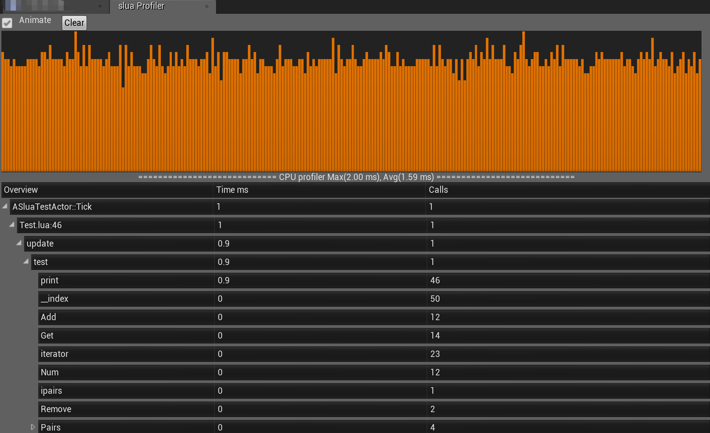
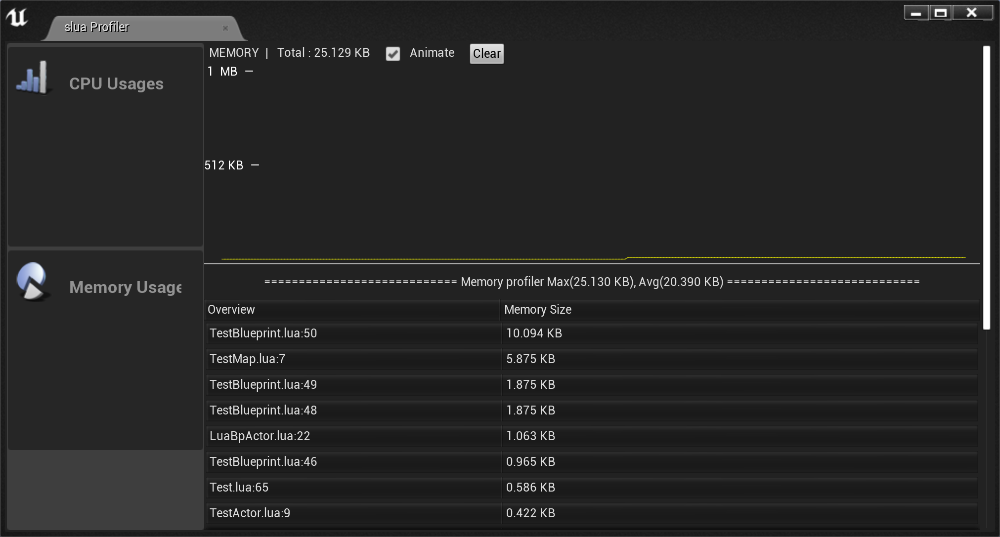
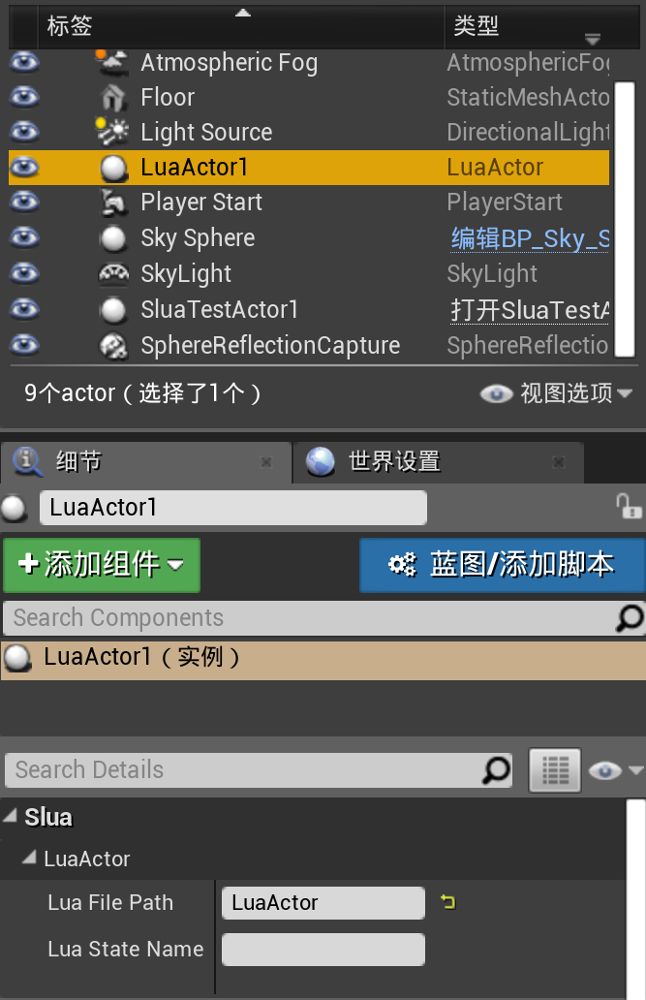

## What's slua-unreal?

Slua-unreal is an unreal4 plugin, which allows you to use Lua language to develop game logic and hot fix your code. It gives you 3 ways to wrap your C++ interface to Lua, including reflection by blueprint, C++ template and static code generation. It also enables a two-way communication between blueprint and Lua.  The advantage of Lua over C++ is that it requires no compilation for logic change, which significantly speeds up game development process.

# slua-unreal 是什么 

slua-unreal作为unreal引擎的插件，通过unreal自带蓝图接口的反射能力，结合libclang静态c++代码分析，自动化导出蓝图接口和静态c++接口，提供给lua语言，使得可以通过lua语言开发unreal游戏业务逻辑，方便游戏高效迭代开发，上线热更新，同时支持lua到c++双向，lua到蓝图双向调用，使用lua语言完美替代unreal的c++开发方式，修改业务逻辑不需要等待c++编译，大大提升开发速度。

目前该项目作为腾讯PUBG手游和潘多拉系统，该系统用于腾讯UE4游戏业务，帮助游戏业务构建周边系统、运营系统，上线质量稳定。

欢迎issue，pr，star，fork。


## Showcases


Slua-unreal is currently adopted in PUBG mobile game, one of Tencent’s most-played and highest-grossing mobile games, and Pandora system. This system is widely used in Tencent’s UE4 gaming business, helping the business build and maintain its commercial operation system.

## What's new?

[Release 1.3.3](https://github.com/Tencent/sluaunreal/releases/tag/1.3.3), fix a crash bug, more stable

[Release 1.3.2](https://github.com/Tencent/sluaunreal/releases/tag/1.3.2), fix building error on UE 4.24

[Release 1.3.1](https://github.com/Tencent/sluaunreal/releases/tag/1.3.1)

Add [a branch](https://github.com/Tencent/sluaunreal/tree/for_4.25) to support UE 4.25 or later

## Features

* Automatic export of blueprint API to the Lua interface 
* Supporting RPC (Remote Procedure Call) functions
* Overriding any blueprint function with a Lua function
* Calling Lua functions as callback functions for blueprint events
* Normal C++ functions and classes exported by C++ template 
* Auto code generation to wrap your normal C++ function for use in Lua
* Supporting enum, FVector etc
* Operator overloading in FVector or other struct class
* Allowing manual addition of a non-blueprint function to UObject
* Calling Lua functions from blueprint, vice versa
* Dead loop detection and error reporting when a dead loop is detected
* Multi-state for different runtime environments
* CPU profiling
* Multithread Lua GC (Garbage Collection)

# slua-unreal 有什么功能

* 通过蓝图反射机制，自动导出unreal 4的蓝图api到lua接口
* 支持rpc函数调用
* 支持复写任何蓝图函数，包括rpc函数，用lua函数替代
* 支持以lua function作为蓝图事件的回调函数
* 支持普通c++函数和类 通过静态代码生成或者泛型代码展开导出到lua接口，同时支持与蓝图接口交互
* 完整支持了unreal4的枚举，并导出了全部枚举值到lua
* 支持FVector等非蓝图类，同时支持操作符重载
* 支持扩展方法，将某些未标记为蓝图方法的函数，手动添加到蓝图类中，例如UUserWidget的GetWidgetFromName方法。
* 支持从蓝图中调入lua，并接收lua返回值，支持任意参数类型和任意参数个数。
* 支持蓝图out标记参数，支持c++非const引用作为out类型参数返回。
* 自动检查脚本死循环，当代码运行超时自动报错。
* 支持多luastate实例，用于创建不同运行环境的luastate。
* lua代码支持cpu profile
* lua 多线程 GC
* 性能分析工具，支持连接真机分析





# 调试器支持

# Debugger Support

我们开发了专门的vs code调试插件，支持真机调试，断点，查看变量值，代码智能提示等功能。调试器自动识别可以使用的UE UFunction蓝图函数和CppBinding导出的接口函数，不需要额外导出静态数据。

We developed a tool integrated with VsCode to support in-device debugging, breakpoint, variable inspection and code IntelliSense. Debugger will auto-generate data for UE UFunction and export C++ functions with CppBinding.


[调试器支持](https://github.com/Tencent/luapanda)
[Debugger](https://github.com/Tencent/luapanda)

# 使用方法简单范例

## Usage at a glance

```lua
-- import blueprint class to use
local Button = import('Button');
local ButtonStyle = import('ButtonStyle');
local TextBlock = import('TextBlock');
local SluaTestCase=import('SluaTestCase');
-- call static function of uclass
SluaTestCase.StaticFunc()
-- create Button
local btn=Button();
local txt=TextBlock();
-- load panel of blueprint
local ui=slua.loadUI('/Game/Panel.Panel');
-- add to show
ui:AddToViewport(0);
-- find sub widget from the panel
local btn2=ui:FindWidget('Button1');
local index = 1
-- handle click event
btn2.OnClicked:Add(function() 
    index=index+1
    print('say helloworld',index) 
end);
-- handle text changed event
local edit=ui:FindWidget('TextBox_0');
local evt=edit.OnTextChanged:Add(function(txt) print('text changed',txt) end);

-- use FVector
local p = actor:K2_GetActorLocation()
local h = HitResult()
local v = FVector(math.sin(tt)*100,2,3)
local offset = FVector(0,math.cos(tt)*50,0)
-- support Operator
local ok,h=actor:K2_SetActorLocation(v+offset,true,h,true)
-- get referenced value
print("hit info",h)
```

## 在蓝图中调用lua

## Calling Lua functions in blueprint


```
-- this function called by blueprint
function bpcall(a,b,c,d)
    print("call from bp",a,b,c,d)
end
```

Output is:

Slua:     call from bp    1024    Hello World 3.1400001049042 UObject: 0x136486168

## 使用lua扩展Actor

## Using Lua extend Actor

```lua
-- LuaActor.lua
local LuaActor={}

-- override event from blueprint
function LuaActor:BeginPlay()
    self.bCanEverTick = true
    print("LuaActor:BeginPlay")
end

function LuaActor:Tick(dt)
    print("LuaActor:Tick",self,dt)
    -- call LuaActor function
    local pos = self:K2_GetActorLocation()
    -- can pass self as Actor*
    local dist = self:GetHorizontalDistanceTo(self)
    print("LuaActor pos",pos,dist)
end

return Class(nil, nil, LuaActor)
```



## Slua 2.0 特性介绍
### Slua Override机制
- 解决1.x版本的生命周期管理问题
- 解决1.x self.Super:Func() 调用，在蓝图有jump指令时崩溃的问题
- Lua模块支持类继承形式书写，例如：

```lua
-- LuaActor.lua
local LuaActor ={}

-- override event from blueprint
function LuaActor:ReceiveBeginPlay()
    self.bCanEverTick = true
    -- set bCanBeDamaged property in parent
    self.bCanBeDamaged = false
    print("actor:ReceiveBeginPlay")
end

-- override event from blueprint
function LuaActor:ReceiveEndPlay(reason)
    print("actor:ReceiveEndPlay")
end

return Class(nil, nil, LuaActor)

-- LuaBpActor.lua
local LuaBpActor = {}

-- override event from blueprint
function LuaBpActor:ReceiveBeginPlay()
    print("bpactor:ReceiveBeginPlay")
    -- call LuaActor super ReceiveBeginPlay
    LuaBpActor.__super.ReceiveBeginPlay(self)
    
    -- call blueprint super ReceiveBeginPlay
    self.Super:ReceiveBeginPlay()
end

local CLuaActor = require("LuaActor")
-- CLuaActor is base class
return Class(CLuaActor, nil, LuaBpActor)
```

- 支持Lua定义RPC函数

```lua
-- LuaActor.lua
local LuaActor = 
{
    ServerRPC = {},     --C2S类RPC列表，类似UFUNCTION宏中的Server
    ClientRPC = {},     --S2C类RPC列表，类似UFUNCTION宏中的Client
    MulticastRPC = {},  --多播类RPC列表，类似UFUNCTION宏中的NetMulticast
}

local EPropertyClass = import("EPropertyClass")

LuaActor.ServerRPC.TestServerRPC = {
    -- 是否可靠RPC
    Reliable = true, 
    -- 定义参数列表
    Params = 
    { 
        EPropertyClass.Int, 
        EPropertyClass.Str, 
        EPropertyClass.bool, 
    }
}

LuaActor.ClientRPC.TestClientRPC = {
    -- 是否可靠RPC
    Reliable = true, 
    -- 定义参数列表
    Params = 
    { 
        EPropertyClass.Int, 
        EPropertyClass.Str, 
        EPropertyClass.bool, 
    }
}

LuaActor.MulticastRPC.TestMulticastRPC = {
    -- 是否可靠RPC
    Reliable = true, 
    -- 定义参数列表
    Params = 
    { 
        EPropertyClass.Int, 
        EPropertyClass.Str, 
        EPropertyClass.bool, 
    }
}

function LuaActor:TestServerRPC(ArgInt, ArgStr, ArgBool)
    
end

function LuaActor:TestClientRPC(ArgInt, ArgStr, ArgBool)
    
end

function LuaActor:TestMulticastRPC(ArgInt, ArgStr, ArgBool)
    
end

```

- 支持Lua定义"值复制"信息，并且支持“条件值复制”、struct、数组

```lua
-- LuaActor.lua
local LuaActor ={}

function LuaActor:GetLifetimeReplicatedProps()
    local ELifetimeCondition = import("ELifetimeCondition")
    local FVectorType = import("Vector")
    return {
        { "Name", ELifetimeCondition.COND_InitialOnly, EPropertyClass.Str},
        { "HP", ELifetimeCondition.COND_OwnerOnly, EPropertyClass.Float},
        { "Position", ELifetimeCondition.COND_SimulatedOnly, FVectorType},
        { "TeamateNameList", ELifetimeCondition.COND_None, EPropertyClass.Array, EPropertyClass.Str},
        { "TeamatePositions", ELifetimeCondition.COND_None, EPropertyClass.Array, FVectorType},
    }
end

return Class(nil, nil, LuaActor)

```

- 被Override的Cpp函数里面可以直接调用对应Lua函数

```cpp
-- MyActor.cpp
class MyActor : public Actor, public ILuaOverriderInterface
{
public:
    void CallDemoFunction()
    {
        CallLuaFunction<bool>(TEXT("IsTestEnable"), Arg1, Arg2);
    }
}

```

```lua
-- MyActor.lua

local MyActor ={}

function MyActor:IsTestEnable(Arg1, Args)
    return true
end

return Class(nil, nil, MyActor)
```


### 机制修改
- struct访问由拷贝改为引用，收益如下：

```
--- 以修改一个Vector类型字段为例

--- 老代码
local Position = Actor.Position
Position.X = 1
Actor.Position = Position

--- 新代码
Actor.Position.X = 1

```

### Slua交互性能优化
- 函数索引相比 1.x 版本有10倍速度提升
- 属性访问、函数调用等，普遍有20%~800%的提升（大部分API速度是原来的1.5\~3倍）。

### 稳定性更加强大
支撑PUBG Mobile 线上业务开发，稳定性得到充分验证。

### 版本支持
- UE4.18、UE4.26完整支持，支持UE5.1，其他版本因为时间精力问题暂时无法支持到位
- 兼容lua 5.4版本接入

## 性能

slua-unreal提供3种技术绑定lua接口，包括：

1）蓝图反射方法

2）静态代码生成

3）CppBinding（模板展开）

其中方法2和3运行原理上没差别，只是方法2是基于libclang自动化生成代码，方法3是手写代码，所以下面的统计上仅针对1和3来对比，可以认为2和3的性能是等价的。

100万次函数调用时间统计（秒），测试用例可以参考附带的TestPerf.lua文件。

测试机器 MacOSX，Unreal 4.18 dev版（非release，release应该会稍微快一点），CPU i7 4GHz。

### Performance

unit in second, 1,000,000 calls to C++ interface from Lua, compared reflection and cppbinding, (both reflection and cppbinding are supported by slua-unreal).

Test on MacOSX, Unreal 4.18 develop building, CPU i7 4GHz, test cases can be found in TestPerf.lua

Without the time spent on gc alloc, the blueprint reflection-based approach is twice as fast as the one using static code generation, while CppBinding is an order of magnitude faster than reflection.

|                                                              | 蓝图反射方法(Reflection) | CppBinding方法(CppBinding) |
| ------------------------------------------------------------ | ------------------------ | -------------------------- |
| 空函数调用(empty function call)                              | 0.541507                 | 0.090571                   |
| 函数返回int(function return int)                             | 0.560052                 | 0.090419                   |
| 传入int函数返回int(function return int and pass int)         | 0.587115                 | 0.097639                   |
| 传入Fstring函数返回int(function return FString and pass int) | 0.930042                 | 0.223207                   |

与slua unity版本相比，因为unreal的蓝图反射更高效，没有gc alloc开销，基于蓝图反射的方法的性能比slua unity的静态代码生成还要快1倍，而cppbinding则快一个数量级。

# 相关参考

slua-unreal依赖dot-clang做c++静态代码生成的工具稍后开源，目前常用FVector等常用类的静态生成代码已经附带。

[使用帮助(Document in Chinese)](https://github.com/Tencent/sluaunreal/wiki)

[更完整的demo](https://github.com/IriskaDev/slua_unreal_demo)


QQ技术支持群：15647305，需要提交具体问题issue后申请入群，谢绝hr和非技术人员进入。

# 附：同品类性能对比
系统Win10 64位
CPU： AMD Ryzen 7 4700G with Radeon Graphics 3.60 GHZ

| 10万次/秒 | Slua | UnLua | Unlua/Slua |
| --- | --- | --- | --- |
|TestStaticCall             	|0.01894	|0.02667	|1.41 |
|TestEmptyCall              	|0.0183		|0.03351	|1.83 |
|TestSetBoolCall            	|0.02541	|0.04206	|1.66 |
|TestGetBoolCall            	|0.02134	|0.04893	|2.29 |
|TestSetIntCall             	|0.02381	|0.04222	|1.77 |
|TestGetIntCall             	|0.02085	|0.04239	|2.03 |
|TestSetFloatCall           	|0.02265	|0.04031	|1.78 |
|TestGetFloatCall           	|0.02167	|0.03701	|1.71 |
|TestSetFStringCall         	|0.04986	|0.08801	|1.77 |
|TestGetFStringCall         	|0.03032	|0.07163	|2.36 |
|TestSetVectorCall          	|0.03339	|0.07208	|2.16 |
|TestGetVectorCall          	|0.05619	|0.0878		|1.56 |
|TestSetStructCall          	|0.0376		|0.07982	|2.12 |
|TestGetStructCall          	|0.08137	|0.08871	|1.09 |
|TestGetObjectCall          	|0.03054	|0.04709	|1.54 |
|TestSetIntVar              	|0.01305	|0.01745	|1.34 |
|TestGetIntVar              	|0.01396	|0.01553	|1.11 |
|TestSetStrVar              	|0.02573	|0.03327	|1.29 |
|TestGetStrVar              	|0.01743	|0.02555	|1.47 |
|TestSetBoolVar             	|0.01362	|0.01559	|1.14 |
|TestGetBoolVar             	|0.01406	|0.01435	|1.02 |
|TestSetFloatVar            	|0.01336	|0.01557	|1.17 |
|TestGetFloatVar            	|0.01381	|0.01585	|1.15 |
|TestSetVectorVar           	|0.0194		|0.01773	|0.91 |
|TestGetVectorVar           	|0.01109	|0.02358	|2.13 |
|TestSetStructVar           	|0.01918	|0.02197	|1.15 |
|TestGetStructVar           	|0.01085	|0.02408	|2.22 |
|TestGetObjectVar           	|0.02111	|0.02322	|1.10 |
|TestAddArrayElement        	|0.05216	|0.07207	|1.38 |
|TestGetArrayElement        	|0.04115	|0.08281	|2.01 |
|TestAddSetElement          	|0.08038	|0.09814	|1.22 |
|TestGetSetElement          	|0.02821	|	        |     |
|TestAddMapElement          	|0.10757	|0.16673	|1.55 |
|TestGetMapElement          	|0.09039	|0.14266	|1.58 |
|TestBPEmptyCall            	|0.06335	|0.07548	|1.19 |
|TestBPSetIntCall           	|0.10759	|0.13205	|1.23 |
|TestBPGetIntCall           	|0.10575	|0.13338	|1.26 |
|TestBPSetBoolCall          	|0.10951	|0.13201	|1.21 |
|TestBPGetBoolCall          	|0.10572	|0.13193	|1.25 |
|TestBPSetStringCall        	|0.13069	|0.18015	|1.38 |
|TestBPGetStringCall        	|0.12013	|0.15976	|1.33 |
|TestBPSetFloatCall         	|0.10626	|0.12982	|1.22 |
|TestBPGetFloatCall         	|0.10486	|0.1291		|1.23 |
|TestBPSetVectorCall        	|0.1204		|0.16478	|1.37 |
|TestBPGetVectorCall        	|0.17194	|0.18061	|1.05 |
|TestBPSetStructCall        	|0.12453	|0.17291	|1.39 |
|TestBPGetStructCall        	|0.17526	|0.18216	|1.04 |
|TestBPSetObjectCall        	|0.11112	|0.1445		|1.30 |
|TestBPGetObjectCall        	|0.11979	|0.14663	|1.22 |
|TestSetBPIntVar            	|0.01288	|0.01696	|1.32 |
|TestGetBPIntVar            	|0.01432	|0.01654	|1.16 |
|TestSetBPStrVar            	|0.02481	|0.03447	|1.39 |
|TestGetBPStrVar            	|0.01701	|0.02515	|1.48 |
|TestSetBPBoolVar           	|0.01318	|0.01801	|1.37 |
|TestGetBPBoolVar           	|0.0131		|0.0163		|1.24 |
|TestSetBPFloatVar          	|0.01194	|0.01646	|1.38 |
|TestGetBPFloatVar          	|0.01352	|0.01554	|1.15 |
|TestSetBPVectorVar         	|0.02013	|0.01738	|0.86 |
|TestGetBPVectorVar         	|0.01127	|0.02289	|2.03 |
|TestSetBPStructVar         	|0.02006	|0.01987	|0.99 |
|TestGetBPStructVar         	|0.01154	|0.02252	|1.95 |
|TestSetBPObjectVar         	|0.018		|0.01898	|1.05 |
|TestGetBPObjectVar         	|0.01885	|0.02216	|1.18 |
|TestAddBPArrayElement      	|0.04994	|0.07266	|1.45 |
|TestGetBPArrayElement      	|0.04117	|0.08902	|2.16 |
|TestAddBPSetElement        	|0.07719	|0.10107	|1.31 |
|TestGetBPSetElement        	|0.08785	|	        |     |
|TestAddBPMapElement        	|0.10685	|0.15537	|1.45 |
|TestGetBPMapElement        	|0.08607	|0.14564	|1.69 |
|TestOverrideSetIntVar      	|0.01253	|0.01691	|1.35 |
|TestOverrideGetIntVar      	|0.01315	|0.01526	|1.16 |
|TestOverrideSetStrVar      	|0.02569	|0.03261	|1.27 |
|TestOverrideGetStrVar      	|0.01637	|0.02755	|1.68 |
|TestOverrideSetBoolVar     	|0.01357	|0.01731	|1.28 |
|TestOverrideGetBoolVar     	|0.01312	|0.01598	|1.22 |
|TestOverrideSetFloatVar    	|0.01298	|0.0168		|1.29 |
|TestOverrideGetFloatVar    	|0.01325	|0.01613	|1.22 |
|TestOverrideSetVectorVar   	|0.02141	|0.01795	|0.84 |
|TestOverrideGetVectorVar   	|0.0103		|0.02297	|2.23 |
|TestOverrideSetStructVar   	|0.01906	|0.01902	|1.00 |
|TestOverrideGetStructVar   	|0.01135	|0.02313	|2.04 |
|TestOverrideSetObjectVar   	|0.02002	|0.02091	|1.04 |
|TestOverrideGetObjectVar   	|0.01871	|0.0226		|1.21 |
|TestOverrideAddArrayElement	|0.04959	|0.07026	|1.42 |
|TestOverrideGetArrayElement	|0.04033	|0.08686	|2.15 |
|TestOverrideAddSetElement  	|0.07604	|0.09988	|1.31 |
|TestOverrideGetSetElement  	|0.08807	|	        |     |
|TestOverrideAddMapElement  	|0.1035		|0.15905	|1.54 |
|TestOverrideGetMapElement  	|0.08564	|0.14475	|1.69 |
|TestOverrideReceiveBeginPlay	|0.00135	|0.03956	|29.30|
|TestOverrideTestFunc			|0.01313	|0.09633	|7.34 |
|TestIndexStaticCall 			|0.00125	|0.00535	|4.28 |
|TestIndexEmptyCall  			|0.00126	|0.00559	|4.44 |
|TestIndexSetBoolCall			|0.00134	|0.0058		|4.33 |
|TestIndexGetBoolCall			|0.00142	|0.00572	|4.03 |
|TestIndexOverrideTestFunc		|0.00109	|0.00069	|0.63 |
